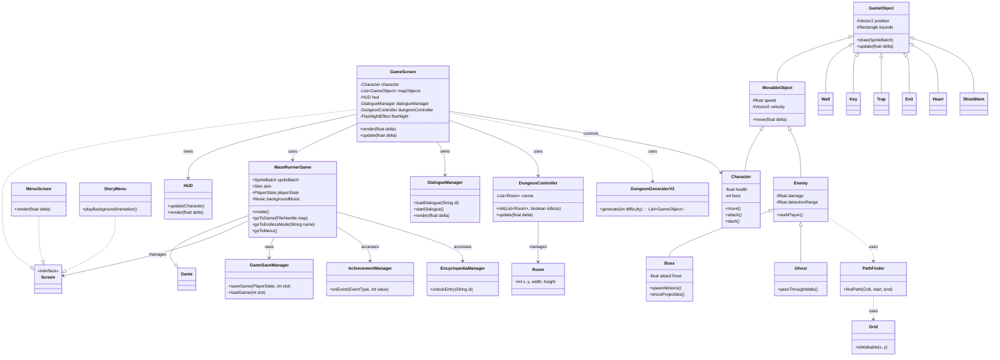

# Maze Runner Game

A Java-based maze runner game built with LibGDX. Navigate through mazes, avoid enemies, collect keys, and find the exit!

## Project Structure

The source code is organized into the following packages under `de.tum.cit.fop.maze`:

### **Root Package** (`de.tum.cit.fop.maze`)
Contains the core game loop and screen management.
-   **`MazeRunnerGame`**: The main entry point extending `LibGDX Game`. It initializes global resources (SpriteBatch, Skin, Audio) and manages screen transitions. Use `goToStory()`, `goToEndlessMode()`, etc., to switch contexts.
-   **`GameScreen`**: The primary gameplay screen. Handles the game loop, rendering of the world, and updates for all game objects.

### **GameObj** (`de.tum.cit.fop.maze.GameObj`)
Defines all interactive and static entities within the game world.
-   **`GameObject`**: Abstract base class for all entities (holds position, texture).
-   **`MovableObject`**: Extends `GameObject` with physics (velocity) and health.
-   **`Character`**: The player-controlled hero. Implements input handling and interaction logic.
-   **`Enemy`**: Base class for hostile mobs with FSM AI (Patrolling, Chasing).
-   **`Ghost`**: A specific enemy type that can fly through walls.
-   **Items**: `Key`, `Heart`, `ShieldItem`.
-   **Environment**: `Wall`, `Trap`, `EntryPoint`, `Exit`.

### **GameControl** (`de.tum.cit.fop.maze.GameControl`)
Manages game systems, UI screens, and persistent data.
-   **Screens**:
    -   **`StoryMenu`**: The new main menu hub with an interactive background.
    -   **`CinematicScreen`**: visual-novel style storytelling screen used for intros and cutscenes.
    -   **`EncyclopediaScreen`**: A gallery to view unlocked characters and items.
    -   **`SkillTreeScreen`**: Interface for upgrading player stats in Endless Mode.
    -   **`LevelSelectionScreen`**: Choose specific levels in Story Mode.
    -   **`SettingsScreen`**: Configure volume and controls.
    -   **`GameOverMenu`** / **`PauseMenu`**: In-game overlays.
-   **Managers**:
    -   **`HUD`**: Heads-Up Display for health, score, and keys.
    -   **`ConfigManager`**: Handles user settings (volume, keybindings).
    -   **`GameSaveManager`**: Serializes game state to JSON for Save/Load functionality.
    -   **`AchievementManager`**: Tracks in-game achievements.
    -   **`LeaderboardManager`**: Manages local and online high scores.
    -   **`EncyclopediaManager`**: Tracks discovered content.

### **AI** (`de.tum.cit.fop.maze.AI`)
Provides navigation logic.
-   **`Grid`**: Boolean grid of the world.
-   **`PathFinder`**: A* (A-Star) algorithm implementation.

### **Conversation** (`de.tum.cit.fop.maze.Conversation`)
Refactored system for dialogue and narrative.
-   **`DialogueManager`**: Central manager for loading and displaying dialogues using JSON data.
-   **`DialogueBox`**: UI component for rendering speech bubbles.
-   **`DialogueData`**: Data model for conversation trees.

### **Procedure** (`de.tum.cit.fop.maze.Procedure`)
Procedural content generation (PCG).
-   **`DungeonGenerator`**: Algorithms to generate random layouts for Endless Mode.
-   **`Room`**: Helper for dungeon geometry.

### **VFX** (`de.tum.cit.fop.maze.VFX`)
Visual effects.
-   **`LightManager`**: Dynamic lighting using FBOs.
-   **`ScreenShake`**: Impact feedback effect.
-   **`DamageNumber`**: Floating combat text.

## Class Hierarchy



## How to Run

1.  **Prerequisites**: Ensure you have a Java Development Kit (JDK) 17 or higher installed.
2.  **Build & Run**:
    This project uses Gradle. Open a terminal (PowerShell or CMD) in the project root.
    
    **Windows (PowerShell)**:
    ```powershell
    .\gradlew desktop:run
    ```
    
    **Windows (CMD)**:
    ```cmd
    gradlew desktop:run
    ```
    
    **Mac/Linux**:
    ```bash
    ./gradlew desktop:run
    ```

## How to Play

### Controls
-   **Movement**: `W`, `A`, `S`, `D` keys.
-   **Pause**: `ESC` key.
-   **Console**: `GRAVE` (`) key (Debug mode).

### Rules
-   **Objective**: Explore the maze to find the **Key**. Once collected, the **Exit** door will open.
-   **Enemies**: Avoid Slimes and Ghosts. Use your shield or skills to survive.
-   **Health**: Lose all lives and it's Game Over.

### Game Modes
1.  **Story Mode**: 
    -   Experience the narrative through **Cinematic Cutscenes**.
    -   Progress through handcrafted levels.
    -   Uncover the mystery of the maze.
2.  **Endless Mode**: 
    -   Face infinite, procedurally generated dungeons.
    -   **XP & Leveling**: Earn XP to level up.
    -   **Skill Tree**: Spend points to upgrade Health, Speed, and Defense in the Skill Tree.
    -   Compete on the global **Leaderboard**.

## Key Features

-   **Cinematic Storytelling**: A meticulously crafted narrative campaign featuring immersive visual-novel storytelling.
-   **Smooth Movement**: Physics-based controls with smart corner sliding.
-   **Loyal Companion**: A dedicated sidekick character that follows and accompanies you throughout the maze.
-   **Strategic Combat**: Battle enemies featuring distinct pathfinding logic, unique behaviors, and specific kill strategies.
-   **Epic Boss Battles**: Challenge the ultimate boss with complex attack patterns and strategic mechanics.
-   **Character-Driven Dialogue**: Experience the story through an expressive interface with dynamic character sprites.
-   **RPG Elements**: Level up and customize your character's stats in Endless Mode.
-   **Immersive Loading**: A meticulously crafted loading animation tailored to match the game's plot.
-   **Dynamic Lighting**: Atmospheric visual effects including fog of war.
-   **Encyclopedia System**: Automatically unlocks entries for characters, enemies, and items as you encounter them.
-   **Interactive Menu Screen**: Click and interact with the character directly on the main menu for unique dialogues.
-   **Online Leaderboard**: Track your best runs against players worldwide.
-   **Hand-Crafted Assets**: Features 50+ original illustrations, 3 music tracks, and 6 custom sound effects.

