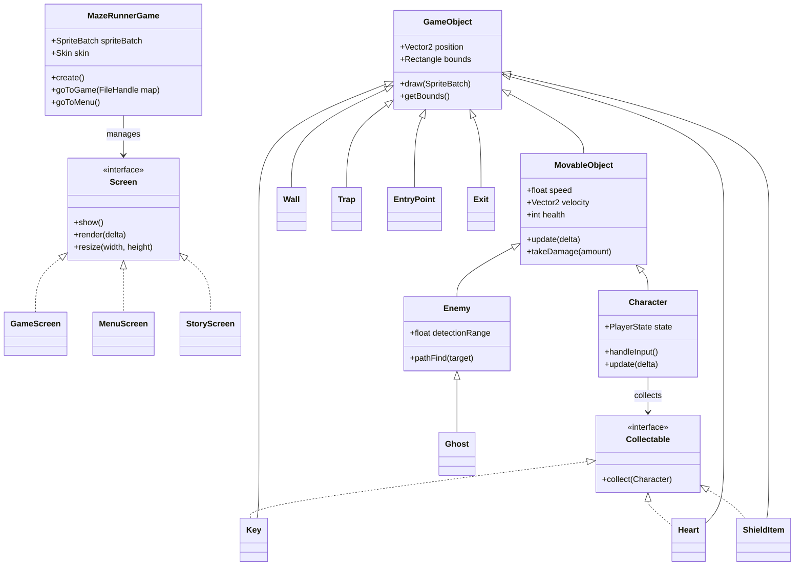

# Maze Runner Game

A Java-based maze runner game built with LibGDX. Navigate through mazes, avoid enemies, collect keys, and find the exit!

## Project Structure

The source code is organized into the following packages under `de.tum.cit.fop.maze`:

- **Root**: Contains the main game entry point `MazeRunnerGame` and various `Screen` implementations (Menu, Game, Story, etc.).
- **GameObj**: Defines all game entities.
    - `GameObject`: Base class for all entities.
    - `MovableObject`: Base for moving entities (Physics, Collision).
    - `Character`: The player character.
    - `Enemy` / `Ghost`: AI-controlled antagonists.
    - Items: `Key`, `Heart`, `ShieldItem`.
- **GameControl**: Manages game systems.
    - `HUD`: Heads-Up Display.
    - `GameConfig` / `ConfigManager`: Settings management.
    - `AchievementManager`: Tracks player achievements.
    - `GameSaveManager`: Handles save/load functionality.
- **AI**: Pathfinding and navigation.
    - `Grid`: Map representation for AI.
    - `PathFinder`: A* algorithm implementation.
- **Conversation**: Dialogue system.
    - `DialogueBox`: UI component for conversations.
    - `StoryDialogueScreen`: Screen for story sequences.
- **Procedure**: Random level generation.
    - `DungeonGenerator`: Generates procedural layouts.
- **VFX**: Visual effects.
    - `LightManager`: Dynamic lighting system.
    - `DamageNumber`: Floating damage text.

## Class Hierarchy (Simplified)



## How to Run

1.  **Prerequisites**: Ensure you have a Java Development Kit (JDK) 17 or higher installed.
2.  **Build & Run**:
    This project uses Gradle. Open a terminal (PowerShell or CMD) in the project root.
    
    **Windows (PowerShell)**:
    ```powershell
    .\gradlew desktop:run
    ```
    
    **Windows (CMD)**:
    ```cmd
    gradlew desktop:run
    ```
    
    **Mac/Linux**:
    ```bash
    ./gradlew desktop:run
    ```

## Game Mechanics

### Controls
-   **Movement**: `W`, `A`, `S`, `D` keys.
-   **Pause**: `ESC` key.
-   **Console**: `GRAVE` (`) key (Debug mode).

### Rules
-   **Objective**: Explore the maze to find the **Key**. Once collected, the **Exit** door will open. Reach it to complete the level.
-   **Enemies**:
    -   **Slimes**: Patrol hallways. Avoid them!
    -   **Ghosts**: Can fly through walls and chase you.
-   **Health**: You start with 4 Lives (Hearts). Touching an enemy loses 1 Heart. If you reach 0, Game Over.

### Items
-   ❤️ **Heart**: Restores 1 Life.
-   🛡️ **Shield**: Grants temporary invulnerability (glowing effect).

### Game Modes
1.  **Story Mode**: Play through crafted levels with a storyline.
2.  **Endless Mode**: Test your skills in procedurally generated dungeons that get harder over time. Earn XP to upgrade your stats (Health, Speed, Defense).
