# Maze Runner Game

A Java-based maze runner game built with LibGDX. Navigate through mazes, avoid enemies, collect keys, and find the exit!


## Project Structure

The source code is organized into the following packages under `de.tum.cit.fop.maze`:

### **Root Package** (`de.tum.cit.fop.maze`)
Contains the core game loop and screen management.
-   **`MazeRunnerGame`**: The main entry point extending `LibGDX Game`. It initializes the SpriteBatch, Skin, and manages screen transitions (Menu -> Game -> Story, etc.).
-   **`GameScreen`**: The primary gameplay screen where the action takes place. Handles the game loop, rendering of the world, and updates for all game objects.
-   **`MenuScreen`**: The main menu interface allowing players to start new games, load saves, or change settings.
-   **`StoryScreen`**: Displays the narrative introduction with a scrolling text effect before the game begins.

### **GameObj** (`de.tum.cit.fop.maze.GameObj`)
Defines all interactive and static entities within the game world.
-   **`GameObject`**: The abstract base class for all entities, holding common properties like position (`Vector2`) and texture.
-   **`MovableObject`**: Extends `GameObject` to add physics (velocity, speed) and health mechanics.
-   **`Character`**: The player-controlled hero. Implements input handling, collision response, and interaction logic (collecting keys, taking damage).
-   **`Enemy`**: Base class for hostile mobs. Implements an FSM (Finite State Machine) for AI behaviors like Patrolling and Chasing.
-   **`Ghost`**: A specific enemy type that can fly through walls, offering a unique challenge.
-   **Items**:
    -   **`Key`**: The objective item required to unlock the exit.
    -   **`Heart`**: Restores player health.
    -   **`ShieldItem`**: Grants temporary invulnerability.
-   **Environment**:
    -   **`Wall`**: Static obstacles that block movement.
    -   **`Trap`**: Stationary hazards that damage the player on contact.
    -   **`EntryPoint` / `Exit`**: Markers for level start and end points.

### **GameControl** (`de.tum.cit.fop.maze.GameControl`)
Manages game systems, UI overlays, and persistent data.
-   **`HUD`**: The Heads-Up Display showing vital info like Hearts (Lives), Timer, Score, and Key status.
-   **`GameConfig` / `ConfigManager`**: Handles loading and saving of user settings (Volume, Keybindings) via JSON.
-   **`AchievementManager`**: Tracks and triggers in-game achievements, notifying the HUD when unlocked.
-   **`GameSaveManager`**: serializes game state to JSON, allowing players to Save and Load their progress.
-   **`LeaderboardManager`**: Manages local and online high scores.

### **AI** (`de.tum.cit.fop.maze.AI`)
Provides navigation logic for enemies.
-   **`Grid`**: Converts the game world into a boolean grid representing walkable and blocked tiles.
-   **`PathFinder`**: Implements the **A* (A-Star)** algorithm to calculate the shortest path for enemies to reach the player.

### **Conversation** (`de.tum.cit.fop.maze.Conversation`)
A system for displaying dialogue and narrative elements.
-   **`DialogueBox`**: A UI component that renders speech bubbles with support for different styles (Normal, Shout, Think).
-   **`StoryDialogueScreen`**: A dedicated screen for visual-novel style storytelling sequences between levels.

### **Procedure** (`de.tum.cit.fop.maze.Procedure`)
Handles procedural content generation (PCG).
-   **`DungeonGenerator`**: Algorithms to randomly generate maze layouts, placing rooms, corridors, enemies, and items based on difficulty.
-   **`Room`**: Helper class defining the geometry of rooms within the generated dungeon.

### **VFX** (`de.tum.cit.fop.maze.VFX`)
Manages visual effects to enhance game feel.
-   **`LightManager`**: Implements a simple dynamic lighting system using FrameBuffer Objects (FBO) to create atmosphere.
-   **`DamageNumber`**: Floating text particles that appear when entities take damage or heal.
-   **`ScreenShake`**: A camera effect used to provide impact feedback during combat or events.

## Class Hierarchy

```mermaid
classDiagram
    %% Core Game
    class MazeRunnerGame {
        +SpriteBatch spriteBatch
        +Skin skin
        +create()
        +goToGame(FileHandle map)
        +goToMenu()
        +goToStory()
        +goToSettings()
    }
    
    %% Screens
    class Screen {
        <<interface>>
        +show()
        +render(delta)
        +resize(width, height)
        +pause()
        +resume()
        +hide()
        +dispose()
    }
    
    MazeRunnerGame --> Screen : manages
    Screen <|.. GameScreen
    Screen <|.. MenuScreen
    Screen <|.. StoryScreen
    Screen <|.. LevelSelectionScreen
    Screen <|.. SettingsScreen
    Screen <|.. AchievementsScreen
    Screen <|.. SkillTreeScreen
    Screen <|.. SaveSlotScreen
    Screen <|.. StoryDialogueScreen
    Screen <|.. DialogueScreen
    Screen <|.. VFXDemoScreen

    %% Game Objects Hierarchy
    class GameObject {
        +Vector2 position
        +float width
        +float height
        +Rectangle bounds
        +TextureRegion textureRegion
        +draw(SpriteBatch)
        +getBounds()
    }
    
    class MovableObject {
        +float speed
        +Vector2 velocity
        +int health
        +int maxHealth
        +update(delta)
        +takeDamage(amount)
        +heal(amount)
    }
    
    class Character {
        +PlayerState state
        +handleInput()
        +update(delta)
        +hasKey()
    }
    
    class PlayerState {
        +int currentHealth
        +int score
        +addScore(points)
    }
    
    class Enemy {
        +float detectionRange
        +pathFind(target)
        +updateCombat()
    }
    
    class Ghost {
        +boolean passThroughWalls
    }
    
    %% Environment & Items
    class Wall
    class Path
    class Trap
    class EntryPoint
    class Exit
    class EnemySpawnPoint
    class GhostSpawnPoint
    
    class Collectable {
        <<interface>>
        +collect(Character)
    }
    
    class Key
    class Heart
    class ShieldItem

    %% Inheritance
    GameObject <|-- MovableObject
    GameObject <|-- Wall
    GameObject <|-- Path
    GameObject <|-- Trap
    GameObject <|-- EntryPoint
    GameObject <|-- Exit
    GameObject <|-- EnemySpawnPoint
    GameObject <|-- GhostSpawnPoint
    
    GameObject <|-- Key
    GameObject <|-- Heart
    GameObject <|-- ShieldItem
    
    MovableObject <|-- Character
    MovableObject <|-- Enemy
    Enemy <|-- Ghost
    
    %% Interfaces
    Collectable <|.. Key
    Collectable <|.. Heart
    Collectable <|.. ShieldItem
    
    %% Systems & Managers
    class MapLoader {
        +loadMap(FileHandle)
        +getMapFiles()
    }
    
    class HUD {
        +update(Character)
    }
    
    class PauseMenu {
        +updateStats()
    }
    
    class GameOverMenu
    
    class ConfigManager {
        +loadConfig()
        +saveConfig()
    }
    class GameConfig
    ConfigManager --> GameConfig
    
    class AchievementManager {
        +unlockAchievement()
    }
    class Achievement
    AchievementManager --> Achievement
    
    class GameSaveManager {
        +saveGame()
        +loadGame()
    }
    class LeaderboardManager
    
    %% UI & Logic Relations
    GameScreen --> HUD
    GameScreen --> PauseMenu
    GameScreen --> GameOverMenu
    GameScreen --> MapLoader
    Character --> PlayerState
    
    %% AI
    class Grid {
        +isWalkable(x, y)
    }
    
    class PathFinder {
        +findPath(Grid, start, end)
    }
    
    Enemy --> PathFinder
    PathFinder --> Grid
    
    %% Dialogues
    class DialogueBox {
        +show(text)
    }
    StoryDialogueScreen --> DialogueBox
    DialogueScreen --> DialogueBox
    
    %% Procedural Generation
    class DungeonGenerator {
        +generate(difficulty)
    }
    class Room
    
    DungeonGenerator --> Room
    DungeonGenerator --> GameObject : creates
    
    %% VFX
    class LightManager {
        +render(batch, lights)
    }
    class PointLight
    class DamageNumber
    class ScreenShake
    
    LightManager --> PointLight
    GameScreen --> LightManager
    GameScreen --> ScreenShake
```


## How to Run

1.  **Prerequisites**: Ensure you have a Java Development Kit (JDK) 17 or higher installed.
2.  **Build & Run**:
    This project uses Gradle. Open a terminal (PowerShell or CMD) in the project root.
    
    **Windows (PowerShell)**:
    ```powershell
    .\gradlew desktop:run
    ```
    
    **Windows (CMD)**:
    ```cmd
    gradlew desktop:run
    ```
    
    **Mac/Linux**:
    ```bash
    ./gradlew desktop:run
    ```

## How to Play

### Controls
-   **Movement**: `W`, `A`, `S`, `D` keys.
-   **Pause**: `ESC` key.
-   **Console**: `GRAVE` (`) key (Debug mode).

### Rules
-   **Objective**: Explore the maze to find the **Key**. Once collected, the **Exit** door will open. Reach it to complete the level.
-   **Enemies**:
    -   **Slimes**: Patrol hallways. Avoid them!
    -   **Ghosts**: Can fly through walls and chase you.
-   **Health**: You start with 4 Lives. Touching an enemy will reduce your Lives. If you reach 0, Game Over.

### Items
-   ❤️ **Heart**: Restores 1 Life.
-   🛡️ **Shield**: Grants temporary invulnerability (glowing effect) and hurt enemies.

### Game Modes
1.  **Story Mode**: Play through crafted levels with a storyline.
2.  **Endless Mode**: Test your skills in procedurally generated dungeons that get harder over time. Earn XP to upgrade your stats (Health, Speed, Defense).

## Key Features

-   **Smooth Movement**: Physics-based character control with acceleration and smart corner sliding.
-   **Dynamic Camera**: Smooth camera tracking that follows the action fluidly.
-   **Online Leaderboard**: Compete with other players in Endless Mode and see global rankings.
-   **Original Soundtrack**: Enjoy custom-composed music and sound effects created specifically for this game.
